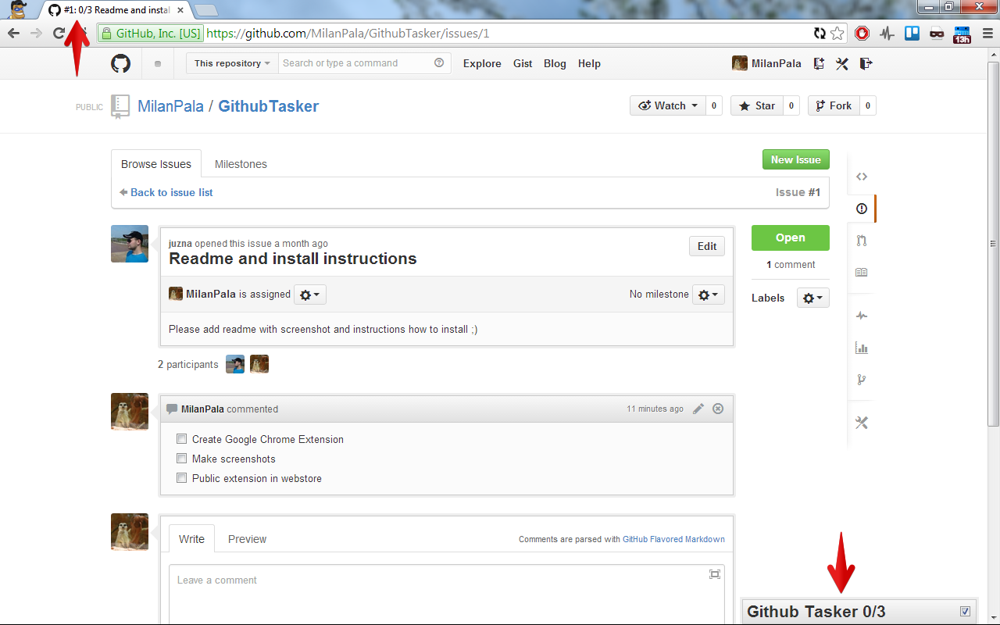
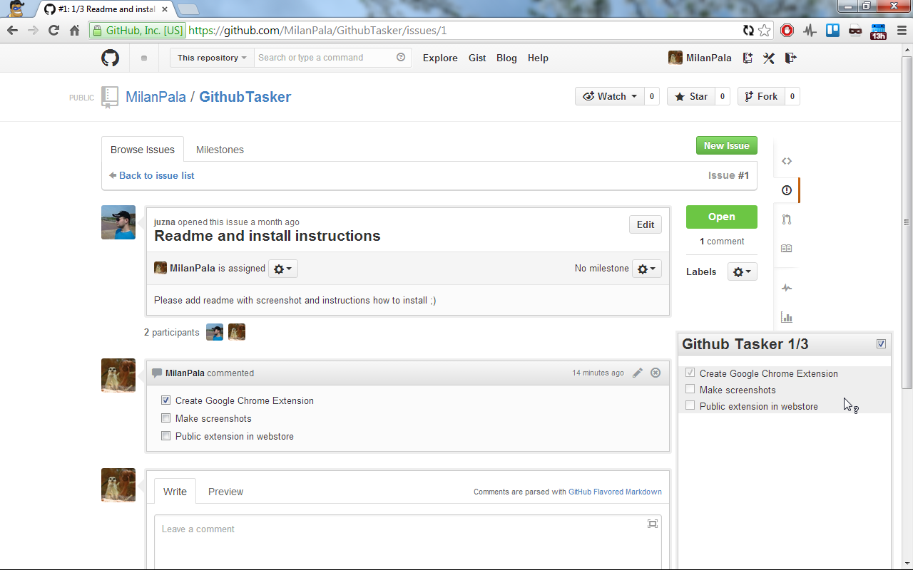

# Github Tasker
Google Chrome extension, which show all task from comments in fixed Taskbar panel on bottom of window.

## Functions
- Show tasks in fixed panel
- Can show only non-finnished tasks
- Settings are saved for each repository

## Instalation
Visit [Github Tasker on Google Chrome Webstore](https://chrome.google.com/webstore/detail/github-tasker/igeoeeodclcjojegahpcfgapliiinpko), install it and enjoy!